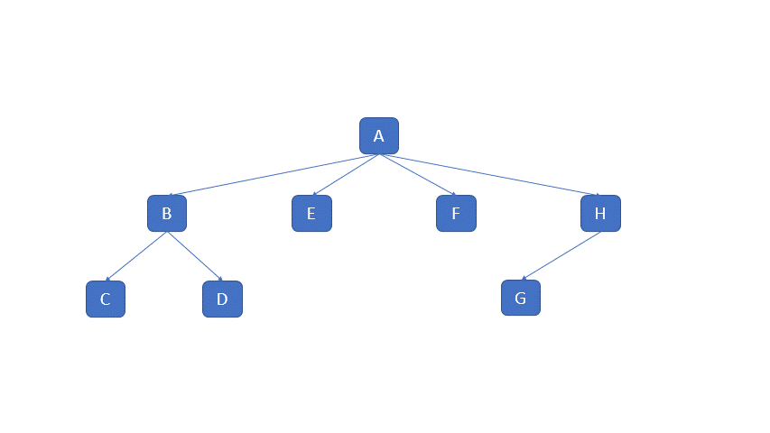

=====
Usage
=====

Define a visitable tree structure
---------------------------------

To use Visitor Design Pattern in a project, you first need to define a tree structure.

This data structure can contain arbitrary nodes of any types.

Only the subclasses of visitor_design_pattern.VisitableInterface will be traversed by the visitors.

.. code:: python

    from visitor_design_pattern import VisitableInterface

    class MyNode(VisitableInterface):

        """First data node type"""

        def __init__(self, name, children=[]):
            self.name = name
            self.children = children
            self.ignored = AnotherNodeType()
    
    class AnotherNodeType(VisitableInterface):

        """Second data node type"""

        pass

    # Instantiate a structure:
    root = MyNode("A", children=[
        MyNode("B", children=[
            MyNode("C"),
            MyNode("D")
        ]),
        MyNode("E"),
        MyNode("F", children=[
            MyNode("G")
        ]),
        MyNode("H")
    ])

Create a visitor using appropriate decorators
---------------------------------------------

Each node in this structure can be visited multiple times, depending on the traversal order (prefix, infix or suffix).

This order can be specified in the user defined visitors using the @prefix, @infix and @suffix method decorators respectively.

Let's write a Pretty printer for this structure using the different decorators:

.. code:: python

    from visitor_design_pattern import visitor, prefix, infix, suffix, traverse

    @visitor() # Declare the class as visitor
    class PrettyPrinter():

        def print(self, *args):
            return print(*args, end="")

        @prefix()
        def visit_node_prefix(self, node: MyNode):
            if len(node.children):
                self.print(f"<{node.name}>")
            else:
                self.print(f"<{node.name}/>")
        
        @infix()
        def visit_node_infix(self, node: MyNode):
            pass # ignore the infix order
        
        @suffix()
        def visit_node_suffix(self, node: MyNode):
            if len(node.children):
                self.print(f"</{node.name}>")
        
        @traverse(["prefix", "infix", "suffix"])
        def do_nothing(self, node: AnotherNodeType):
            pass
    
    pp = PrettyPrinter()
    root.accept(pp)

The @traverse decorator allows to reuse one same visit method for multiple traversal orders.

Please note that:
 - @prefix() is equivalent @traverse("prefix")
 - @infix() is equivalent @traverse("infix")
 - @suffix() is equivalent @traverse("suffix")

.. warning::

    Type anotations are crucial in the definition of each visiting method of the visitor.
    The @visitor class decorator will throw a ValueError if a decorated method does not provide
    an explicit type anotation on the first argument after self.

Implement a custom accept method
--------------------------------

By default, the visitors will traverse any attribute of the current node which is a subclass of VisitableInterface.
This behavior can by redefining the accept method of the user defined visitor:

.. code:: python

    class MyNode(VisitableInterface):

        """Data node type"""

        def __init__(self, name, children=[]):
            self.name = name
            self.children = children
            self.ignored = AnotherNodeType()
        
        def accept(self, visitor):
            
            """Example custom accept method"""

            visitor.visit_prefix(self)
            for i, child in enumerate(self.children):
                child.accept(visitor)
                if i < len(value) - 1:
                    visitor.visit_infix(self)
            visitor.visit_suffix(self)

This accept method will work just fine with our previous examples, but may not be able to pass return values from/to children/parents in the tree structure

Using the default accept method of VisitableInterface to pass return values
---------------------------------------------------------------------------

It is possible that a child node in the tree may need the result value of its parent.
It is also possible that the infix visit method of a node need the result of the prefix method for the same node.

Some special keyword arguments are available with the user defined visit methods in order to access these useful values:
 - parent_res: return value of the prefix call on the parent of the current node
 - prefix_res: return value of the prefix call on the current node
 - visited_attrs: mapping attribute -> return value of the accept method on each attribute

 .. code:: python

    @visitor()
    class AnotherVisitor():

        @prefix()
        def visit_node_prefix(self, node: MyNode, parent_res=None):
            ...
        
        @infix()
        def visit_node_infix(self, node: MyNode, parent_res=None, prefix_res=None):
            ...
        
        @suffix()
        def visit_node_suffix(self, node: MyNode, parent_res=None, prefix_res=None, visited_attrs=None):
            ...
        
        ...

 .. warning::
    
    The parent_res parameter may be defined for any traversal order.

    The prefix_res parameter may only be defined for the infix and suffix traversal orders

    The visited_attrs parameter can only be defined for the suffix traversal order

 .. note::

    The default accept method of the VisitableInterface returns a tuple of the form (parent_res, visited_attrs, suffix_res) with suffix_res being the return value of the suffix call on the current node.

    This also means that the values of the the visited_attrs parameter are tuples of this form.

 .. note::

    This implementation of accept happened to be convenient to me, and is provided as is. Feel free to reimplement an accept method in a subclass of VisitableInterface if you would like to have another (simpler) behavior.